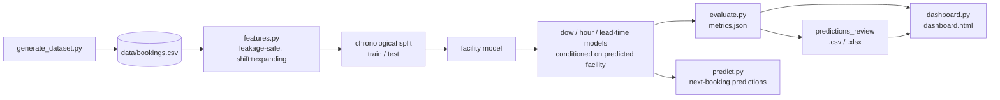

# Facility Usage Prediction System

[](https://github.com/abhi-srivastava/facility-usage-prediction/actions/workflows/ci.yml)

A working prototype that predicts, for a residential community's shared
facilities (gym, pool, courts, clubhouse, etc.), a resident's **next
booking**: which facility, which day of week, which hour, and when to send
a booking reminder ("nudge"). Built for the Anacity/Anarock Facility Usage
Prediction System brief.

See [`docs/TECHNICAL_DOCUMENTATION.md`](docs/TECHNICAL_DOCUMENTATION.md) for
the full write-up of data, features, modelling choices, results, and
limitations. This README covers setup, how to run it, and the repo layout.

## Quick start

```bash
python3 -m venv .venv && source .venv/bin/activate
pip install -r requirements.txt
python run_pipeline.py
```

That single command (~1-2 minutes on a laptop):
1. Generates the synthetic dataset (`data/bookings.csv`) if it doesn't exist yet.
2. Trains the four prediction models on a chronological training split.
3. Evaluates them on the held-out, chronologically-later test set and writes the prediction-review outputs.
4. Runs a forward-looking prediction for every resident's next booking, as of "today".
5. Compares Random Forest vs. Gradient Boosting and runs a 4-fold rolling-origin cross-validation.
6. Regenerates the dataset EDA figures and the interactive review dashboard.

Then open **[`outputs/dashboard.html`](outputs/dashboard.html)** directly in
a browser — it's a single self-contained file, no server needed.

Each stage can also be run on its own:

```bash
python -m src.generate_dataset    # regenerate data/bookings.csv from scratch
python -m src.train                # train + persist models/*.joblib
python -m src.evaluate             # score the held-out test set
python -m src.predict              # forward-looking next-booking predictions
python -m src.model_comparison     # RF vs. HGB + rolling-origin CV
python -m src.eda                  # dataset evidence figures -> docs/figures/
python -m src.dashboard            # rebuild outputs/dashboard.html
python tests/test_leakage.py       # prove the feature pipeline has no leakage
```

## Pipeline



## Deliverables in this repo

| Item | Where |
|---|---|
| Synthetic dataset | [`data/bookings.csv`](data/bookings.csv) |
| Technical documentation | [`docs/TECHNICAL_DOCUMENTATION.md`](docs/TECHNICAL_DOCUMENTATION.md) |
| **Prediction review — interactive UI table** | [`outputs/dashboard.html`](outputs/dashboard.html) *(open directly in a browser)* |
| Prediction review — spreadsheet | [`outputs/predictions_review.csv`](outputs/predictions_review.csv), [`outputs/predictions_review.xlsx`](outputs/predictions_review.xlsx) |
| Evaluation metrics | [`outputs/metrics.json`](outputs/metrics.json) |
| Model comparison + cross-validation | [`outputs/model_comparison.json`](outputs/model_comparison.json) |
| Forward next-booking predictions | [`outputs/next_booking_predictions.csv`](outputs/next_booking_predictions.csv) |
| Dataset evidence figures | [`docs/figures/`](docs/figures/) |
| Trained model artifacts | [`models/`](models/) |
| Leakage-safety tests | [`tests/test_leakage.py`](tests/test_leakage.py) |

## Project layout

```
facility-usage-prediction/
├── data/
│   └── bookings.csv              synthetic booking history (the dataset)
├── src/
│   ├── generate_dataset.py       synthetic data generator
│   ├── features.py               leakage-safe feature engineering
│   ├── models.py                 model definitions + design matrix
│   ├── train.py                  fit & persist the four models
│   ├── evaluate.py               score on held-out test set, write review output
│   ├── predict.py                forward-looking prediction for all residents
│   ├── model_comparison.py       RF vs. HGB + rolling-origin cross-validation
│   ├── eda.py                    dataset evidence figures
│   └── dashboard.py              builds the self-contained review dashboard
├── tests/
│   └── test_leakage.py           mechanical proof the pipeline has no leakage
├── models/                       trained model artifacts (.joblib)
├── outputs/                      metrics, review tables, dashboard, comparisons
├── docs/
│   ├── TECHNICAL_DOCUMENTATION.md
│   └── figures/                  EDA charts referenced from the docs
├── .github/workflows/ci.yml      runs tests + full pipeline on every push
├── run_pipeline.py               one-command end-to-end run
├── requirements.txt
└── requirements-dev.txt          + pytest, for running tests/
```
