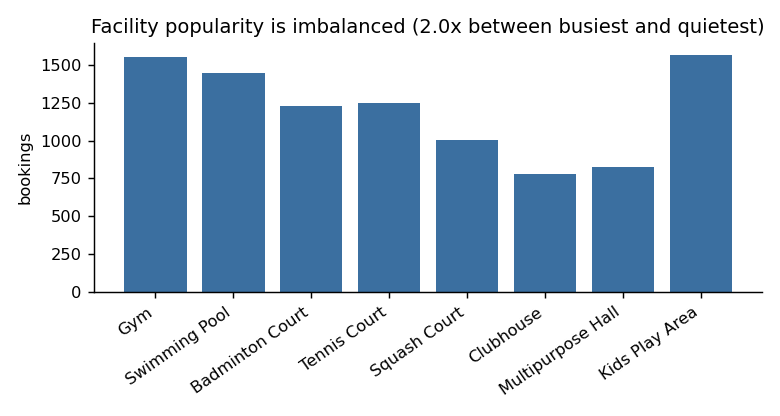
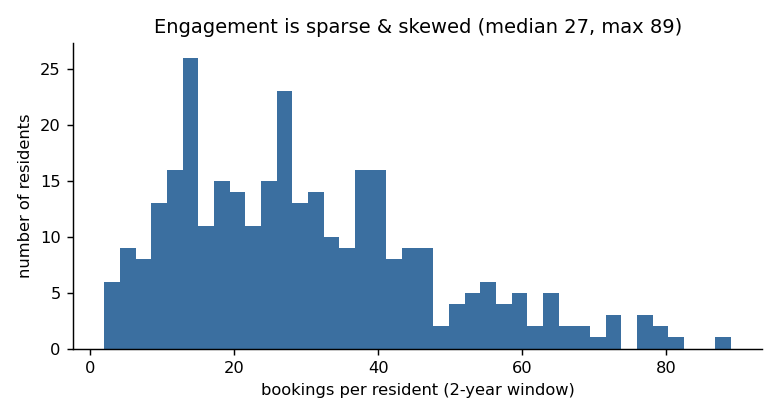
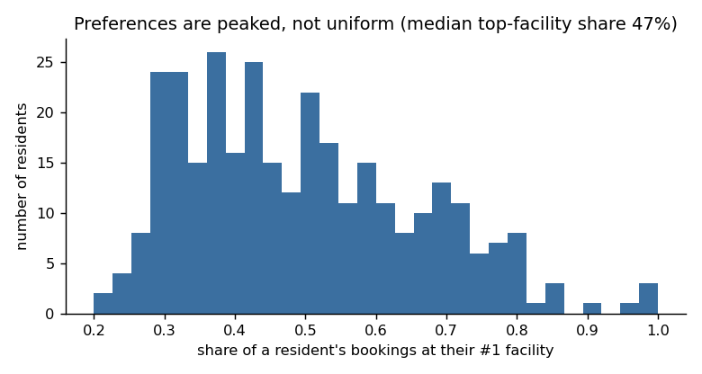
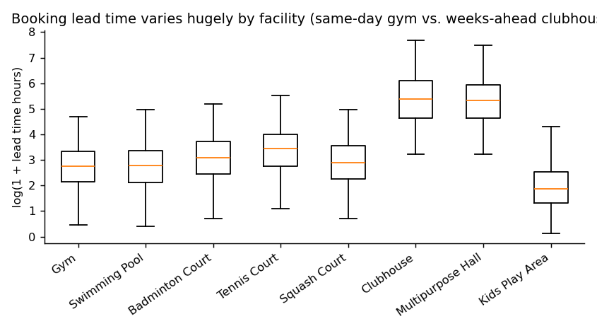
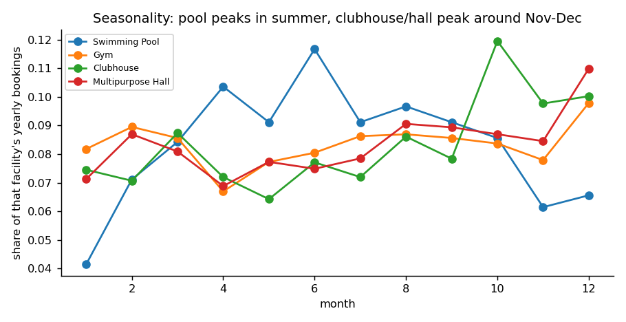
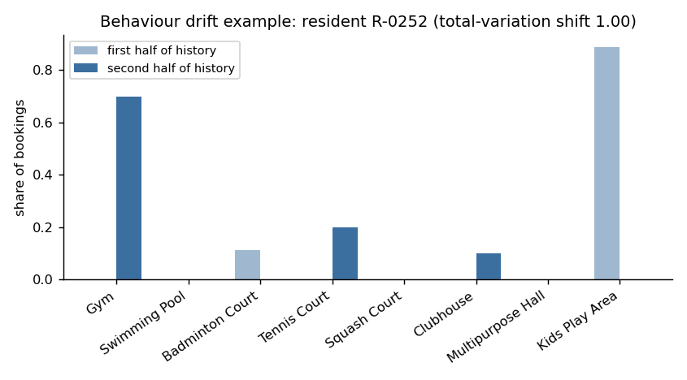

# Technical Documentation — Facility Usage Prediction System

## 1. Problem framing

For a residential community with shared facilities, we want to predict a
resident's **next booking** before it happens: which facility, on which day
of the week, at what hour, and how far in advance to send a reminder
("nudge"/notification). This is framed as a **next-event prediction**
problem over each resident's chronological booking sequence: given
everything known up to a point in time, predict the attributes of the next
booking event. Four outputs are predicted per booking:

1. **Facility** (multi-class classification, 8 facilities)
2. **Usage day of week** (multi-class classification, 7 classes)
3. **Usage hour** (multi-class classification — facilities operate on
   discrete hourly slots, so this is a "which slot" problem, not a
   continuous regression)
4. **Notification / nudge time**, operationalised as the **lead time**
   (hours between booking creation and usage) a resident is likely to book
   with. Regression on this, then converted back to a clock time relative to
   the predicted usage time for display purposes.

## 2. Synthetic dataset

Generated by [`src/generate_dataset.py`](../src/generate_dataset.py).
320 residents, 8 facilities (Gym, Swimming Pool, Badminton Court, Tennis
Court, Squash Court, Clubhouse, Multipurpose Hall, Kids Play Area), simulated
over a 2-year window (2024–2025) with a `booking_id`-keyed event log:
`resident_id, facility, booking_timestamp, usage_timestamp, household_size,
has_kids, move_in_date`. This produced **~9,700 bookings**, distributed
roughly 800–1,600 per facility (deliberate ~2x imbalance: gym/pool/kids-area
are popular, clubhouse/multipurpose-hall are rare event-driven bookings).

Design choices that make history genuinely predictive but non-trivial:

- **Resident preference profiles**: each resident gets a sparse Dirichlet
  preference vector over facilities (low concentration → most residents have
  1–2 "regular" facilities, like real life), further biased by archetype
  flags (`has_kids` → Kids Play Area, `sporty` → racquet sports, `wellness`
  → gym/pool).
- **A "usual slot" per facility per resident** (used ~78% of the time, with
  the rest sampled from a broader morning/evening-weighted distribution) —
  this is what makes the **usage hour** learnable from history at all;
  without it, hour would be close to random noise within a facility's open
  slots.
- **Day-of-week archetypes**: weekday-regular / weekend-warrior / mixed,
  sampled per resident.
- **Facility popularity & seasonality**: global popularity weights plus a
  per-month seasonality multiplier (e.g. pool up in warmer months, gym up in
  January, clubhouse/hall up around the Nov–Dec event season).
- **Booking-lead-time habit**: a persistent "planner / last-minute / typical"
  trait per resident (log-normal lead times), layered on facility-level norms
  (gym: often booked hours ahead; clubhouse: often booked weeks ahead).
- **Engagement / sparsity / imbalance**: booking frequency is drawn from a
  heavily right-skewed log-normal distribution — most residents book rarely,
  a few book very often — producing realistic sparsity per resident.
- **Behaviour drift**: ~15% of residents undergo a gradual (60-day blended)
  preference shift at a random point in the timeline, simulating things like
  a New Year fitness resolution or a lifestyle change.
- **Noise**: ~6% of bookings ignore preference entirely (random facility
  exploration); a small fraction (~1%) of `household_size` values are
  blanked to simulate missing data.

### Evidence these properties are actually in the data

Rather than just asserting the above, [`src/eda.py`](../src/eda.py) generates
the figures below directly from `data/bookings.csv`:

| | |
|---|---|
|  |  |
|  |  |
|  |  |

The drift example (bottom-right) is found **empirically** — by comparing each
resident's first-half vs. second-half facility mix and picking the largest
shift — rather than read off the generator's hidden parameters, so it's
evidence about the data, not the code that made it. Resident R-0252 goes
from 89% Kids Play Area bookings to 0%, and from 0% Gym to 70%, right around
the midpoint of their history — consistent with the ~15% of residents given
a scripted behaviour shift (a plausible real-world story: a resident whose
children aged out of the play area and who then took up a fitness routine).

## 3. Leakage-safe feature engineering

Implemented in [`src/features.py`](../src/features.py). The rule: **every
feature for booking row _i_ uses only information available strictly before
that booking's `booking_timestamp`** — never anything about the booking
being predicted (not even other bookings that happen to share its resident
or facility if they occurred later in time).

Mechanism: sort all bookings globally by `booking_timestamp`. For any
per-resident running statistic, use the `shift(1)` → `expanding()` pattern:
shifting first removes the current row from the window, so the subsequent
expanding aggregate only ever sees strictly-prior rows of that resident.
The same pattern is applied **globally** (across all residents) for
community-wide popularity features, so a global "how popular is the pool
right now" feature also can't see the future.

Feature groups:

- **Resident history depth/recency**: `n_prior_bookings`,
  `days_since_last_booking`, `days_since_movein`.
- **Resident facility preference history**: proportion of each resident's
  *prior* bookings that went to each facility (`pref_<facility>`), plus
  `last_facility` used.
- **Resident day-of-week history**: proportion of prior bookings on each
  weekday (`daypref_<day>`).
- **Resident hour history**: expanding mean/std of prior usage hours,
  `last_hour`.
- **Resident lead-time history**: expanding mean/median/std of prior
  lead times.
- **Community-wide popularity, time-aware**: for each facility, the share of
  *all* prior bookings (any resident) that went to it, computed at the same
  point in time as the row being featurized — captures trends/seasonality
  without hindsight.
- **Booking-time calendar context**: month, day-of-week, hour, and
  weekend flag of the moment the booking was *made* (a legitimate "as of
  now" anchor — it is not the value being predicted).
- **Static resident attributes**: `household_size`, `has_kids`.
- **Cold start**: a resident's very first booking has no personal history;
  those rows get an `is_cold_start` flag and fall back to global
  expanding statistics rather than `NaN`.

### Proving the leakage-safety claim mechanically

[`tests/test_leakage.py`](../tests/test_leakage.py) doesn't just assert
leakage-safety in prose — it tests it directly:

1. Pick a booking mid-way through a resident's history.
2. Rewrite the facility and usage time of **every booking at or after that
   point** (that resident's own later bookings, and everyone else's) to
   something else entirely, leaving `booking_timestamp` (the leakage
   boundary) untouched.
3. Recompute features from scratch and assert the probe booking's feature
   vector is **byte-for-byte identical** — if any feature had secretly
   depended on the future, this would catch it.
4. As a sanity check that this isn't vacuously true (e.g. because the
   features are constants), a mirror-image test scrambles the **past**
   instead and asserts the same row's features **do** change.

Runs automatically on every push via GitHub Actions (see
[`.github/workflows/ci.yml`](../.github/workflows/ci.yml)); locally:
`python tests/test_leakage.py`.

### Cascaded (two-stage) model design

Usage day/hour/lead-time depend heavily on **which facility** is being
booked (a badminton court has completely different open hours than a
clubhouse). So after the facility model, the day/hour/lead-time models get
one extra categorical input, `facility_context`:

- **At training time**, `facility_context` = the *actual* facility of that
  historical booking (a known fact, not leakage — we're teaching "given this
  is a gym booking, what hour is typical").
- **At evaluation/inference time**, the true future facility isn't known, so
  `facility_context` = the **facility model's own prediction**.

This is a standard cascaded-pipeline pattern. It measurably improved usage
hour accuracy (from ~20% to ~38%) because the model can now learn
per-facility time patterns explicitly rather than averaging over a
resident's mixed facility history. The trade-off, noted in Limitations, is
error propagation: if stage 1 mispredicts the facility, stage 2 inherits
that error.

### Alternatives considered

- **Predicting usage hour as a continuous regression** — rejected because
  facilities operate on discrete slots (see `FACILITIES[...]["slots"]` in
  the generator); classification directly optimises for "which slot",
  and mean-absolute-error in hours is still reported as a secondary metric.
- **A single joint multi-output model** — rejected in favour of four
  separate models (with the facility→time cascade) because the four
  outputs have different structure (categorical vs. skewed-continuous) and
  separate models make error analysis per output straightforward.
- **k-NN / collaborative-filtering style "similar residents"** — reasonable
  alternative, not used here because with only 320 residents and sparse
  per-resident histories, a tree ensemble over aggregated history features
  generalises better and is easier to make leakage-safe and reproducible.

## 4. Models

All four heads are scikit-learn `RandomForest{Classifier,Regressor}`
(200 trees, depth ≈ 10–11, `random_state=42`), chosen for robustness on a
small-to-medium tabular dataset with mixed numeric/categorical features and
no need for extensive hyperparameter search. Lead time is modelled as
`log1p(lead_time_hours)` regression (then `expm1`-transformed back) to tame
its strongly right-skewed distribution (same-day gym bookings up to
multi-week clubhouse bookings).

## 5. Evaluation protocol

**Chronological holdout, not random split.** [`src/features.py`](../src/features.py)
`chronological_split()` sorts all bookings by `booking_timestamp` and takes
the most recent ~18% as the test set (cutoff ≈ 2025‑08‑22, giving 7,914
train / 1,738 test rows). Because every feature is already leakage-safe at
the row level (built only from bookings strictly before that row's own
timestamp), this chronological cut is a strict evaluation of "how well would
this have predicted the next few months," including for residents who also
have some bookings before the cutoff.

### Results (held-out test set, 1,738 bookings)

| Output | Metric | Model | Naive baseline* |
|---|---|---|---|
| Facility | Accuracy / macro-F1 | **43.5% / 0.42** | 15.2% (always predict global mode) |
| Usage day of week | Exact accuracy (±1 day) | **50.7% (81.4%)** | 18.1% |
| Usage hour | Exact accuracy / MAE | **38.5% / 2.7h** | 15.2% |
| Notification lead time | Median abs. error / match rate** | **13.7h / 24.3%** | MAE 64h |

\* "Always predict the community-wide most common value." A resident's own
last-used facility ("persistence") does better than the global mode
(34.0% accuracy) but is still well below the trained model.

\*\* Match = predicted lead time within `max(3h, 15% of actual lead time)` —
a flat window would be unfairly strict for multi-week clubhouse bookings and
unfairly loose for same-day gym bookings.

**Overall**: averaged across all four outputs, the model gets **1.57 of 4
outputs correct per booking** (vs. ~0.74/4 for the naive baseline), with
**48.5%** of bookings getting at least 2 of 4 right and **8.7%** getting all
4 right (see [`outputs/metrics.json`](../outputs/metrics.json) for full
numbers, and [`outputs/predictions_review.csv`](../outputs/predictions_review.csv)
/ `.xlsx` for the row-by-row predicted-vs-actual table with match
indicators, in the format illustrated in the brief).

### Facility top-k accuracy and confidence-gated nudging

A single-guess accuracy number understates how useful the facility model is
for a real recommendation/nudge use case, where showing a short list or
gating on confidence is normal:

| Metric | Value |
|---|---|
| Top-1 accuracy | 43.5% |
| Top-2 accuracy (correct facility in the model's top 2 guesses) | **62.8%** |
| Top-3 accuracy | **73.9%** |

And if the system only sends a facility nudge when the model is confident
enough (`predict_proba` max class probability), accuracy on the nudges that
*do* go out rises sharply, at the cost of covering fewer residents:

| Minimum confidence | Residents covered | Facility accuracy on those nudges |
|---|---|---|
| 0.00 (nudge everyone) | 100% | 43.5% |
| 0.25 | 78% | 48.1% |
| 0.35 | 49% | 54.9% |
| 0.45 | 22% | 64.7% |
| 0.55 | 7% | 71.1% |

This is the more realistic way to read the facility model's performance for
a production nudge system: don't force a guess for every resident — only act
where the model is actually confident, and cover the rest with a generic
reminder or a top-3 shortlist. Full curve in
`metrics.json → error_analysis.confidence_gated_nudging`, and both this and
top-k are visualised in the [interactive dashboard](#6-interactive-review-dashboard).

### Model comparison and cross-validation stability

Two checks that the single train/test split above isn't misleading
(run via `python -m src.model_comparison`, output in
[`outputs/model_comparison.json`](../outputs/model_comparison.json)):

- **Model family**: Random Forest (43.5% accuracy, macro-F1 0.42) beats
  scikit-learn's Histogram Gradient Boosting (40.4% accuracy, macro-F1 0.38)
  on the same split for facility prediction — validating Random Forest as
  the chosen family rather than just asserting it.
- **Rolling-origin (walk-forward) cross-validation**: instead of one
  train/test cutoff, the test window is slid across 4 sequential later
  periods. Facility accuracy is **42.9% ± 0.6%** across folds — tight
  variance, meaning the headline number isn't a lucky single split:

  | Fold | Test window | Accuracy |
  |---|---|---|
  | 0 | 2025-03-10 → 2025-05-26 | 43.4% |
  | 1 | 2025-05-26 → 2025-08-09 | 42.7% |
  | 2 | 2025-08-09 → 2025-10-18 | 42.0% |
  | 3 | 2025-10-18 → 2025-12-31 | 43.5% |

### Error analysis

- **By facility** (`error_analysis.facility_accuracy_by_true_facility` in
  `metrics.json`): Swimming Pool (54.7%) and Gym (48.5%) predict best —
  they're the most frequent, most habitual facilities. Clubhouse is worst
  (25.8%) — low-frequency, event-driven bookings with less regular history
  per resident.
- **By history depth**: accuracy is fairly flat across "1–3 prior
  bookings" (50%), "4–10" (41%), "10+" (44%) — light users are predicted
  about as well as heavy users here, because facility preference is usually
  visible from the very first booking (sparse Dirichlet profiles). True
  cold-start (zero prior bookings) essentially doesn't occur in this test
  window since most residents' first-ever booking falls earlier in the
  2-year history.
- **Top confusions** are concentrated among facilities with overlapping
  archetypes/time slots (e.g. Kids Play Area ↔ Swimming Pool, Squash ↔
  Badminton, Clubhouse → Gym) — residents who split time between a couple of
  facilities are the hardest to call correctly, as expected.

## 6. Interactive review dashboard

[`outputs/dashboard.html`](../outputs/dashboard.html) is a single
self-contained HTML file (built by `python -m src.dashboard`, no server or
internet connection needed — data is embedded inline, so double-clicking it
just works) that gives the "spreadsheet or UI table" deliverable a browsable
form: headline KPIs, per-output vs. baseline bars, the top-k/confidence-gating
tables above, error analysis, model comparison, and the full 1,738-row
predicted-vs-actual table with search, per-facility and per-match-status
filters, sortable columns, and pagination. `outputs/predictions_review.csv` /
`.xlsx` remain the flat-file version of the same data.

## 7. Reproducing the results

```bash
pip install -r requirements.txt
python run_pipeline.py
```

`run_pipeline.py` regenerates the dataset only if `data/bookings.csv` is
missing, so re-running it against the **submitted** dataset (already in the
repo) will retrain and re-evaluate against the exact same data — the
`random_state=42` seeds used throughout (data generation, train/test split,
model fitting) make the reported numbers reproducible. It also rebuilds the
model comparison, EDA figures, and dashboard. A GitHub Actions workflow
([`.github/workflows/ci.yml`](../.github/workflows/ci.yml)) runs the leakage
tests and the train → evaluate → predict → dashboard chain on every push, so
reproducibility is checked mechanically, not just claimed.

## 8. Limitations

- **Synthetic data**: patterns (preference peakiness, "usual slot" habit
  strength, drift frequency) are hand-tuned to be realistic but are not
  fitted to a real community's data; a production deployment would need to
  re-validate these modelling choices against real booking logs.
- **Error propagation in the cascade**: usage day/hour/lead-time models
  condition on the *predicted* facility at inference time, so a wrong
  facility prediction (~57% of the time) can drag down the conditional
  outputs even when the resident's day/hour habits are otherwise
  predictable.
- **Exact-hour and exact-day accuracy understate real usefulness**: e.g.
  day-of-week is right or within one day 81% of the time, and mean hour
  error is under 3 hours — a real nudge system would likely use these
  tolerant metrics (or a top-k / ranked suggestion UI) rather than requiring
  an exact hit.
- **Lead-time / notification regression has a long right tail**
  (clubhouse/hall bookings up to ~60 days ahead vs. gym bookings within
  hours), which is why mean absolute error (77h) is far higher than the
  median (13.7h) — a few large-scale facilities dominate the mean. The
  relative match-rate metric and log-scale MAE are more representative of
  typical performance.
- **True cold start (a resident's very first-ever booking) is not well
  evaluated** here because so few occur inside the test window; the
  fallback-to-global-priors behaviour for such rows is implemented and
  flagged (`is_cold_start`) but not heavily stress-tested.
- **No hyperparameter tuning**: Random Forest was validated against Hist
  Gradient Boosting as a model *family* (§ Model comparison), but neither was
  tuned via a cross-validation grid search — settings were chosen for
  reasonable, reproducible performance and a small on-disk footprint. There
  is headroom left on the table.
